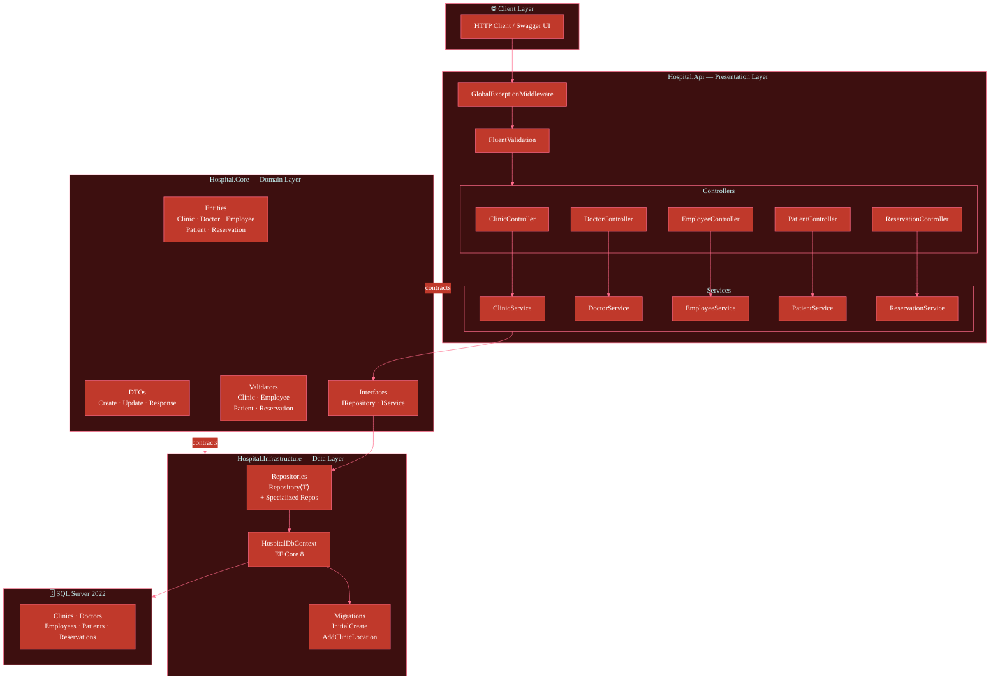
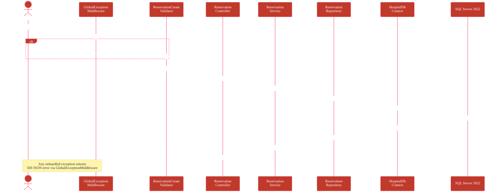
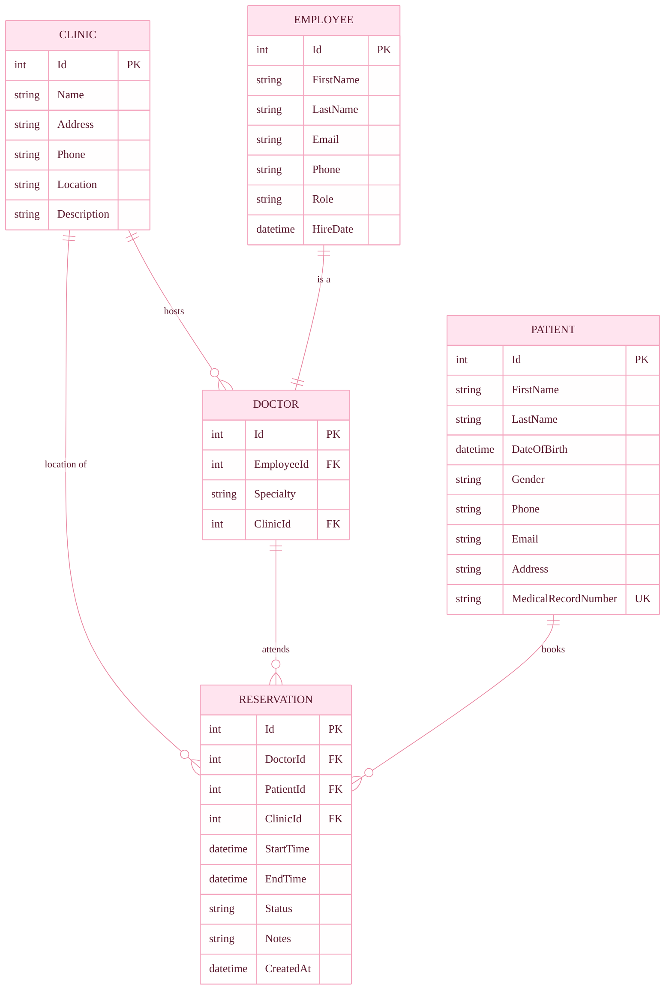

<div align="center">


<br/>

[](https://git.io/typing-svg)

<br/>


<br/>


</div>

---

## 🏥 Overview

**HospitalSystem** is a production-ready, containerized REST API built with **.NET 8** and **Clean Architecture** principles. It provides complete management of hospital operations — clinics, doctors, employees, patients, and reservations — through a structured, layered API with full validation, global error handling, and Swagger documentation.

Designed for **hospital staff and administrators**, the system enforces strict data integrity, supports rich filtering and pagination across all resources, and is fully deployable via Docker Compose with a single command.

---

## ✨ Features

<div align="center">

| Module | Capabilities |
|:---|:---|
| 🏢 **Clinics** | Full CRUD · Search · Pagination · Location tracking |
| 👨‍⚕️ **Doctors** | Full CRUD · Clinic assignment · Specialty filter · Search |
| 👔 **Employees** | Full CRUD · Role filter · Hire-date filter · Search |
| 🧑‍🤝‍🧑 **Patients** | Full CRUD · MRN lookup · Gender/Age filter · Search |
| 📅 **Reservations** | Create · Delete · Multi-filter · Doctor/Patient views |

</div>

<br/>

- 🔒 **Global Exception Middleware** — consistent error responses across all endpoints
- ✅ **FluentValidation** — request validation on all write operations
- 📄 **Swagger UI** — auto-generated, interactive API docs (Development only)
- 🐳 **Docker Compose** — one-command full-stack deployment with SQL Server 2022
- 📦 **Generic Repository** — `Repository<T>` base with specialized per-entity extensions
- 🔁 **DTO Pattern** — clean separation between API contracts and domain entities
- 📊 **Pagination** — `PagedResult<T>` on every list endpoint with configurable page size

---

## 🏗️ System Architecture



---

## 🔄 Request Lifecycle — POST /api/reservation



---

## 📊 Entity Relationships



---

## 📈 Metrics

<div align="center">

| Metric | Value |
|:---|:---:|
| 📁 Source Files | **64** |
| 🔗 API Endpoints | **33** |
| 🗂️ Domain Entities | **5** |
| 🗃️ DB Migrations | **2** |
| 🧱 Architecture Layers | **3** |
| ✅ Validated Operations | **4 modules** |

</div>

---

## 🛠️ Tech Stack

<div align="center">


</div>

---

## 📁 Project Structure

```
HospitalSystem/
├── 📄 HospitalSystem.sln
├── 🐳 docker-compose.yml
├── 📄 .env.example
│
├── 🔷 Hospital.Api/                    # Presentation layer
│   ├── Controllers/
│   │   ├── ClinicController.cs
│   │   ├── DoctorController.cs
│   │   ├── EmployeeController.cs
│   │   ├── PatientController.cs
│   │   └── ReservationController.cs
│   ├── Services/                       # Service implementations
│   ├── Middleware/
│   │   └── GlobalExceptionMiddleware.cs
│   ├── Dockerfile
│   ├── Program.cs
│   ├── appsettings.json
│   └── appsettings.Development.json
│
├── 🔶 Hospital.Core/                   # Domain layer (no dependencies)
│   ├── Entities/
│   │   ├── Clinic.cs · Doctor.cs · Employee.cs
│   │   ├── Patient.cs · Reservation.cs
│   ├── DTOs/
│   │   ├── Common/  (PagedResult, PaginationParams)
│   │   ├── Clinic/ · Doctor/ · Employee/
│   │   └── Patient/ · Reservation/
│   ├── Interfaces/
│   │   ├── Repositories/  (IRepository + 5 specific)
│   │   └── Services/      (5 service interfaces)
│   └── Validators/
│       ├── ClinicCreateValidator.cs
│       ├── EmployeeCreateValidator.cs
│       ├── PatientCreateValidator.cs
│       └── ReservationCreateValidator.cs
│
└── 🔸 Hospital.Infrastructure/         # Data access layer
    ├── Data/
    │   └── HospitalDbContext.cs
    ├── Repositories/
    │   ├── Repository.cs              # Generic base
    │   ├── ClinicRepository.cs · DoctorRepository.cs
    │   ├── EmployeeRepository.cs · PatientRepository.cs
    │   └── ReservationRepository.cs
    ├── Extensions/
    │   └── QueryableExtensions.cs
    └── Migrations/
        ├── 20251114154201_InitialCreate.cs
        └── 20251114181647_AddClinicLocation.cs
```

---

## 🚀 Getting Started

### Prerequisites

- [.NET 8 SDK](https://dotnet.microsoft.com/download/dotnet/8.0)
- [Docker Desktop](https://www.docker.com/products/docker-desktop)
- SQL Server 2022 (or use Docker Compose — recommended)

---

### Option A — Docker Compose (Recommended)

```bash
# 1. Clone the repository
git clone https://github.com/YOUR_USERNAME/hospital-system.git
cd hospital-system

# 2. Set up environment variables
cp .env.example .env
# Edit .env and fill in your DB_SA_PASSWORD and other values

# 3. Start the full stack (API + SQL Server)
docker-compose up --build

# API is available at:
# http://localhost:8080/swagger
```

---

### Option B — Local Development

```bash
# 1. Clone and restore
git clone https://github.com/YOUR_USERNAME/hospital-system.git
cd hospital-system
dotnet restore

# 2. Configure connection string
# Edit Hospital.Api/appsettings.Development.json
# Set your local SQL Server connection string

# 3. Apply migrations
dotnet ef database update \
  --project Hospital.Infrastructure \
  --startup-project Hospital.Api

# 4. Run
cd Hospital.Api
dotnet run

# Swagger UI: https://localhost:5001/swagger
```

---

## 🔌 API Reference

<div align="center">

| Method | Endpoint | Description |
|:---:|:---|:---|
| `GET` | `/api/clinic` | Paged list with optional search |
| `GET` | `/api/clinic/{id}` | Get clinic by ID |
| `POST` | `/api/clinic` | Create clinic |
| `PUT` | `/api/clinic/{id}` | Update clinic |
| `DELETE` | `/api/clinic/{id}` | Delete clinic |
| `GET` | `/api/doctor` | Paged list with clinic & search filters |
| `GET` | `/api/doctor/{id}` | Get doctor by ID |
| `POST` | `/api/doctor` | Create doctor |
| `GET` | `/api/patient/mrn/{mrn}` | Get patient by Medical Record Number |
| `GET` | `/api/reservation/doctor/{doctorId}` | All reservations for a doctor |
| `GET` | `/api/reservation/patient/{patientId}` | All reservations for a patient |
| `POST` | `/api/reservation` | Create reservation |
| `DELETE` | `/api/reservation/{id}` | Cancel reservation |

> Full interactive documentation available at `/swagger` when running in Development mode.

</div>

---

## 🔮 Future Work

- [ ] 🔐 **Authentication & Authorization** — JWT Bearer tokens with role-based access (Admin, Doctor, Staff)
- [ ] 📧 **Notification Service** — Email/SMS confirmation on reservation create/cancel
- [ ] 📊 **Reporting Module** — Occupancy rates, doctor workload, patient statistics
- [ ] 🔁 **Reservation Update Endpoint** — `PUT /api/reservation/{id}` with status transitions
- [ ] 🧪 **Unit & Integration Tests** — xUnit test suite with EF Core in-memory provider
- [ ] 🗂️ **Audit Logging** — Track all create/update/delete operations with timestamps and actor
- [ ] 📦 **CI/CD Pipeline** — GitHub Actions workflow for build, test, and Docker publish
- [ ] 🌍 **Localization** — Multi-language API error messages

---

<div align="center">


<br/>

**Built with ❤️ using .NET 8 · EF Core · SQL Server · Docker**

[](LICENSE)
[](https://dotnet.microsoft.com)

</div>
